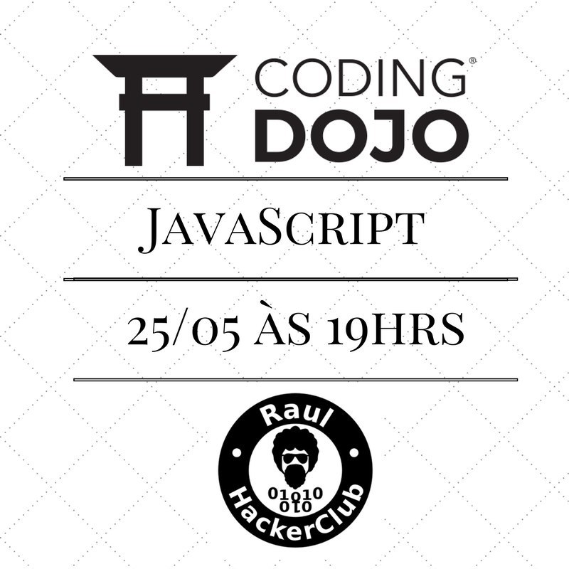
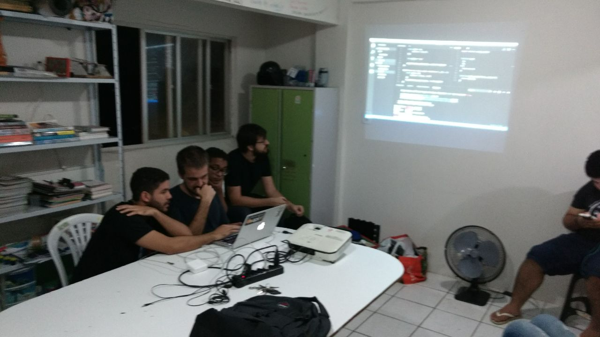
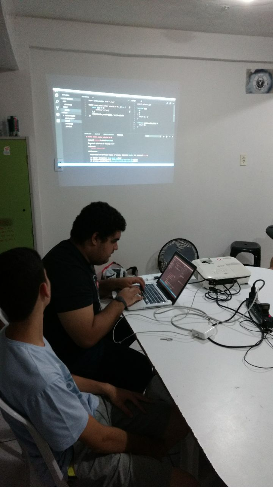

# Coding Dojo de Javascript no Raul HC

## Organização e divulgação.

Foi divulgado no [site do raul](http://raulhc.cc/Agenda.2017-05-25-CodingDojoDeJavascript). [Vinicius Melo]() ficou responsável por abrir o hacker club e recepcionar o pessoal.

Não houve inscrições, e cerca de 12 pessoas compareceram.

## O evento

[Mauricio Vieira](https://github.com/mauriciovieira) começou o evento fazendo a apresentação [coding dojo in 5 minutes](https://github.com/mauriciovieira/coding-dojo-in-5-minutes) e um problema foi sorteado no dojo-puzzles. O problema escolhido foi o [número de erdos](http://dojopuzzles.com/problemas/exibe/numero-de-erdos/) e a solução está nesse repositório

## Retrospectiva

### 😄

- Quebra de bloqueio
- Javascript +2 
- Aprender TDD
- Respeito
- Primeiro dojo com TDD
- Falar em voz alta
- Rio Vermelho / Raul!

### 🙁

- Faltou cerveja
- Faltou coffee break

### 💡

- Problema possível de ser resolvido
- Problema mais simples e depois outro
- Inscrições pagas para custear a cerveja
- Cada um trazer sua cerveja, e continuar entrada franca
- Ajuda com o repositório do Dojo-Bahia

### ❓

- Como funcionam os testes no Jest?
- Quando será o próximo?

## Fotos

