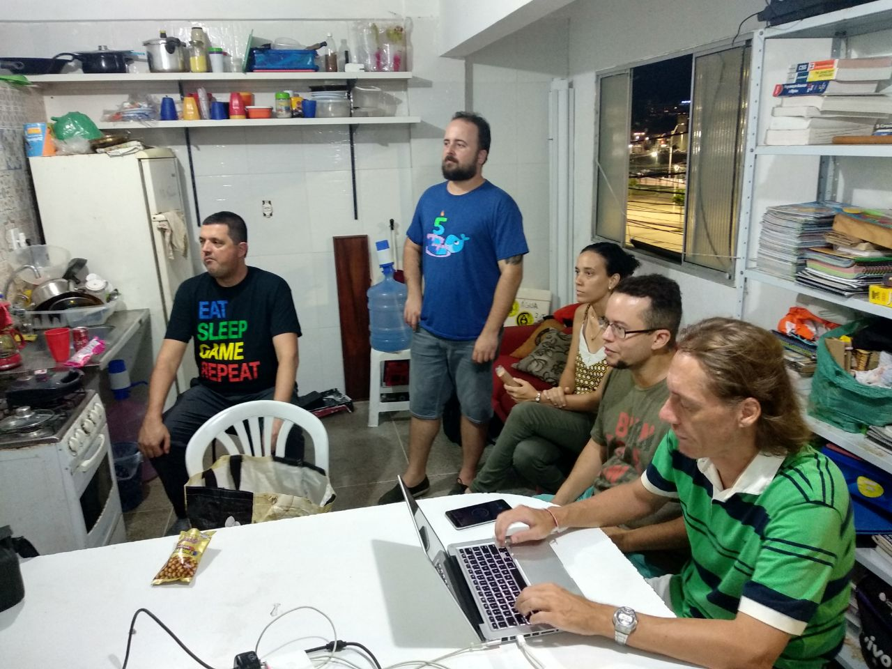
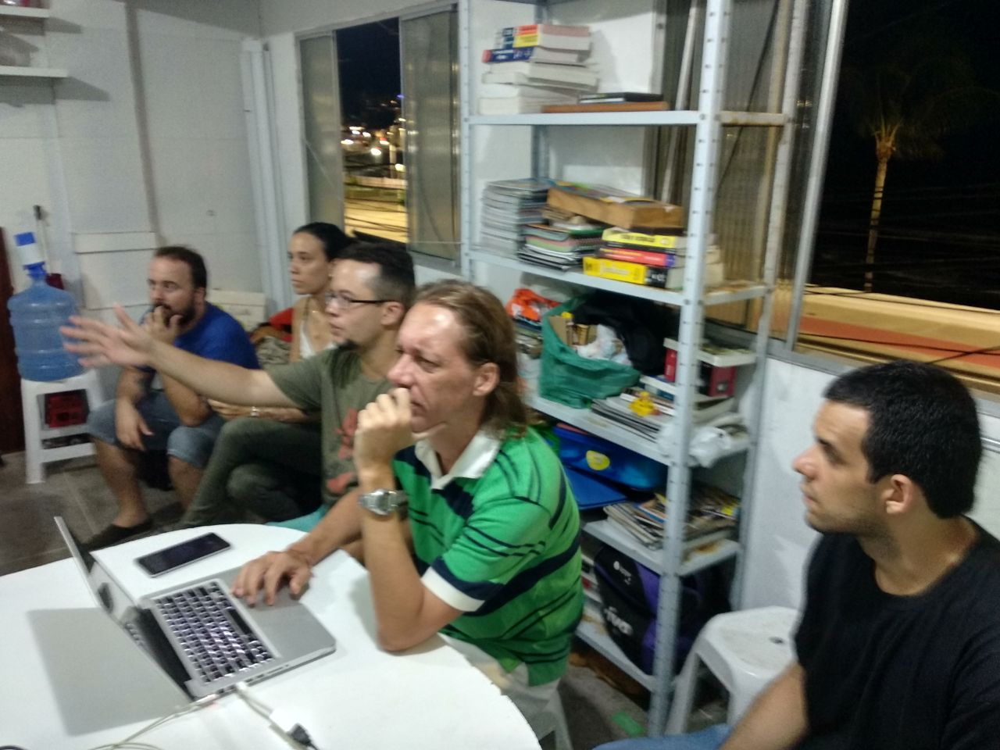
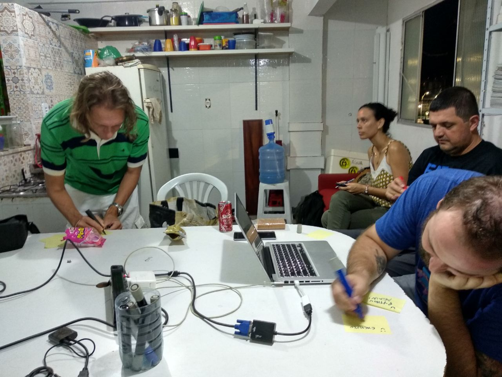
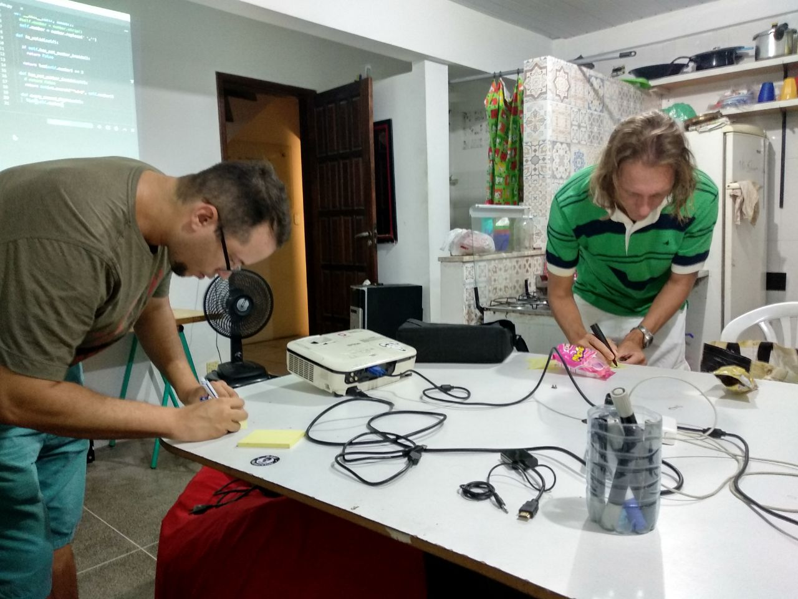

# Coding Dojo de Python no Raul HC

## Organização e divulgação.

Foi divulgado nas listas e redes sociais. [Ricardo S](https://t.me/massarelos) ficou responsável por abrir o hacker club e recepcionar o pessoal. [Geisa S](https://t.me/ge1sasant0s) fez a imagem para divulgação

Texto enviado para as listas:
- dojo-bahia@googlegroups.com
- grupy-ba@googlegroups.com
- raulhc@lists.riseup.net

para os grupos do telegram:
- [dojo-bahia](https://t.me/dojobahia)
- [Grupy-BA](https://t.me/grupyba)
- [Meetup Bahia](https://t.me/meetupba)
- [Raul HackerClub não-oficial](https://t.me/raulhackerclubnaooficial)

E nos grupos do facebook:
- [GrupyBA](https://web.facebook.com/groups/grupyba/permalink/3061540480538724/)
- [TI Bahia](https://web.facebook.com/groups/213479555518461/permalink/1009844525881956/)
- [TI na Bahia](https://web.facebook.com/groups/TInaBahia/permalink/2173992946021570/)

> Pessoal,
> Desculpas pelo crossposting (raulhc, dojo-bahia e grupy-ba)
>
> Amanhã, quinta-feira, 14/03/2019 vamos realizar um Coding Dojo no Raul HackerClub das 19h00 às 21h00
>
> Agenda:
> - 18:00 as 19:00, abertura do local e apresentações pessoais
> - 19:00 as 20:00, coding dojo
> - 20:00 as 20:30 retrospectiva e discussão sobre a atividade
> - 20:30 as 21:00 reunião do Grupy-BA Salvador
>
> O RaulHC estará aberto a partir das 18h00 (obrigado Ricardo!)
> Endereço: Rua da Paciência, nº 257, CEP: 41950-010, Salvador - Bahia. Em cima do antigo Irish Pub Dubliners, ou do lado do Chupito, sala 101 (primeiro andar). http://raulhc.cc/Doc/Sede#ComoChegar
>
> Atenção: o evento não possui patrocínio, então o coffee break é comunitário. Traga algo pra si e pros outros.

## O evento

Estavam presentes
- [@f-lima](https://github.com/f-lima)
- [@gomex](https://github.com/gomex)
- [@loulix](https://github.com/loulix)
- [@luisaoba](https://github.com/luisaoba)
- [@mauriciovieira](https://github.com/mauriciovieira)
- [@rsandrade](https://github.com/rsandrade)
- alan.moreno@hotmail.com

Fizemos rodadas de 5 minutos por cerca de 1h20m.

O desafio escolhido foi [luhn](https://github.com/exercism/python/tree/master/exercises/luhn). O código está nesse repositório

## Retrospectiva

Após a atividade, fizemos uma retrospectiva com post-its. Cada um teve direito a um post-it de cada categoria abaixo.

Ao fim, discutimos um pouco alguns deles, mas a discussão não será relatada aqui.

### 😄

- Relembrar testes.
- Interação (2x)
- Boa impressão do espaço do Raul HC
- Escrever um código "real"
- Linguagem de programação.
- Problema.
- Python Again!
- Exemplo próximo ao real.
- Coffee-break comunitário
- Raul HC!
- Projetor com HDMI e VGA
- [Ricardo S](https://t.me/massarelos) abriu o espaço

### 🙁

- A interação poderia ser maior, p.ex., os presentes poderiam sugerir 1 questão por minuto, caso o código esteja "emperrado"
- Cabo! (conexão do projetor ao computador)
- Esqueci meus óculos
- Teclado Mac
- Baby Steps perde muito tempo para resolver o problema.
- Interrupções
- Pouca gente.
- Divulgação em cima da hora.
- Duas pessoas não quiseram programar.
- Cheguei atrasado.

### 💡

- Desafios podem ser votados pela comunidade
- Dojo de API
- Criar um grupo de dúvidas online

### ❓

- Começar às 19:00
- Semanal
- Registro
- Backup
- Se lotasse, como faríamos?
- Se divulgarmos antes, podemos abrir inscrições?
- Quando é o próximo?
- Tem cerveja?
- Link para o problema

## Fotos

